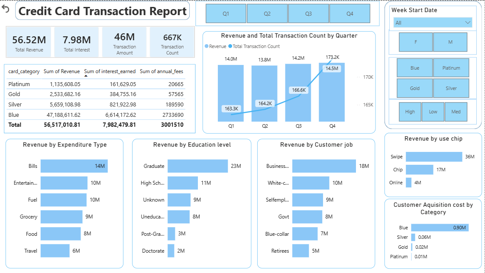
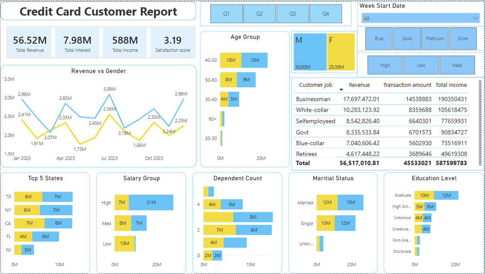

# 💳 Credit Card Analytics Dashboard

## 📊 Overview
This project presents an end-to-end data analysis solution for credit card transactions and customer data. It combines SQL-based data storage with interactive Power BI dashboards to generate actionable business insights.

The solution consists of:
- Credit Card Transaction Dashboard
- Credit Card Customer Dashboard

---

## 🎯 Objective
The objective of this project is to:
- Analyze credit card transaction data to identify revenue trends  
- Understand customer behavior and segmentation  
- Build an interactive dashboard for business decision-making  
- Simulate a real-world data workflow using a database  

---

## ❗ Problem Statement
Organizations handle large volumes of financial data but often struggle to:
- Identify high-value customers  
- Understand spending patterns  
- Track revenue performance over time  
- Optimize marketing and customer acquisition strategies  

This project solves these problems by transforming raw data into a structured and visual analytical solution.

---

## ⚙️ Approach

### Data Preparation
- Collected raw data in CSV format  
- Cleaned and validated the dataset  
- Handled missing values and inconsistencies  

### Database Implementation
- Imported CSV data into PostgreSQL  
- Created structured tables for transactions and customers  
- Applied SQL queries for data validation and transformation  
- Ensured proper data types and relationships  

### Data Visualization
- Connected Power BI to the processed dataset  
- Created calculated measures (Revenue, Interest, Transaction Count)  
- Designed interactive dashboards with filters and slicers  
- Used charts and KPIs for clear data representation  

---

## 🗄️ Data Storage & SQL Processing
To simulate a real-world data pipeline:

- Stored raw data in PostgreSQL instead of using flat files directly  
- Created normalized tables for better data management  
- Used SQL queries to prepare data for analysis  
- Improved data reliability and scalability  

---

## 📈 Results & Insights
- 💰 Total Revenue: **56.5M+**  
- 💳 Blue card category generates the highest revenue  
- 📊 Q4 has the highest transaction volume  
- 🧾 Top spending categories:
  - Bills  
  - Entertainment  
  - Fuel  
- 👨‍💼 Business professionals contribute the highest revenue  
- 👥 High-income customers drive major transactions  

### Business Impact
- Helps identify high-value customers  
- Supports targeted marketing strategies  
- Improves decision-making using data insights  
- Enables better understanding of customer behavior  

---

## 📊 Transaction Dashboard
Key insights:
- Revenue trends across quarters  
- Transaction volume analysis  
- Revenue by card category (Blue, Silver, Gold, Platinum)  
- Spending patterns across categories  
- Transaction modes (Swipe, Chip, Online)  

---

## 👥 Customer Dashboard
Key insights:
- Customer segmentation by age, gender, and income  
- Revenue contribution by education and job role  
- Top states contributing to revenue  
- Customer acquisition cost  
- Income vs transaction behavior  

---

## 🛠️ Tools & Technologies
- Power BI  
- PostgreSQL  
- SQL  
- Microsoft Excel  
- Data Cleaning & Transformation  
- Data Visualization  
- DAX (Data Analysis Expressions)  

---

## 📷 Dashboard Screenshots

### 🔹 Transaction Dashboard

### 🔹 Customer Dashboard

> 📌 Make sure images are stored inside an `images` folder in the repository.

---

## 🚀 How to Run
1. Clone the repository  
2. Open the `.pbix` file in Power BI Desktop  
3. Connect to your PostgreSQL database (if required)  
4. Use filters and slicers to explore insights  

---

## 🔮 Future Enhancements
- Add customer churn prediction model  
- Build real-time ETL pipeline  
- Deploy dashboard on Power BI Service  
- Integrate with cloud database (AWS / Azure)  

---

## 🙌 Conclusion
This project demonstrates an end-to-end data analysis workflow, starting from raw data storage in PostgreSQL to building interactive dashboards in Power BI. It highlights practical skills in SQL, data visualization, and business analytics.

---

⭐ If you found this useful, consider giving it a star!
